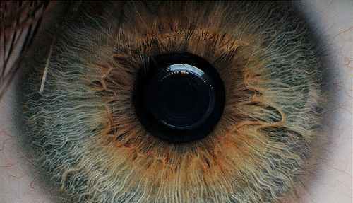

```{r setup, include=FALSE}
knitr::opts_chunk$set(echo = TRUE)
source("imageHelpers.R")
```

#Funkcje do obróbki obrazów

## Ładowanie obrazów
```{r Image loading}
img = loadImage("eye.jpg")
```
<center></center>

## Konwersja do skali szarości
```{r Grayscale}
saveImage(img %>% grayscaled(), "results/eye_gray.jpg")
```
<center></center>

## Inwersja
```{r Inversion}
saveImage(img %>% inverted(), "results/eye_inverted.jpg")
```
<center></center>

## Regulacja jasności
```{r Lighting}
saveImage(img %>% brightned(0.2), "results/eye_brightned.jpg")
saveImage(img %>% brightned(-0.2), "results/eye_darkened.jpg")
```
<center>
  
  
</center>

## Regulacja kontrastu
```{r Contrast}
saveImage(img %>% contrasted(), "results/eye_contrasted.jpg")
```
<center></center>

## Binaryzacja obrazu
```{r Binarization}
binaryImage = img %>% 
    contrasted() %>% 
    grayscaled() %>%
    binarized(function(x) {x < 0.4})

saveImage(binaryImage, "results/eye_binarized.jpg")
```
<center></center>

```{r Projections}
saveImage(binaryImage %>% verticalProjection(), "results/vertical.jpg")
saveImage(binaryImage %>% horizontalProjection(), "results/horizontal.jpg")
```
<center></center>
<center></center>
